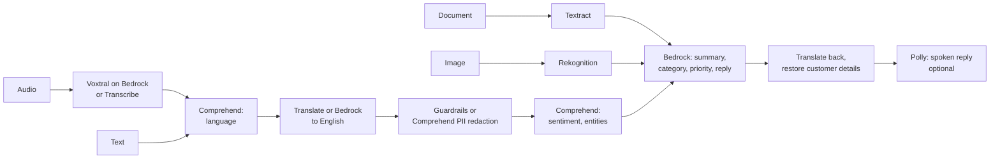

# AWS AI Support Copilot

A multilingual customer-support pipeline that turns voice calls, scanned documents and product
photos into structured cases and drafted replies. It orchestrates Amazon Bedrock, Textract,
Rekognition, Comprehend and (optionally) Translate, Transcribe, Polly, Bedrock Guardrails and
Lambda behind a small, testable Python core.



## What it does

1. **Understands the request.** Transcribes audio, detects the language, translates to English.
2. **Protects customer data.** PII is replaced with numbered tokens (`[[NAME_1]]`) before any text
   reaches a language model, and restored only in the final reply.
3. **Reads attachments.** Textract extracts receipt text; Rekognition labels product photos.
4. **Triages.** A Bedrock model returns a summary, category, priority and a drafted reply.
5. **Replies in the customer's language.**

Example (`copilot analyze --text "Hola, mi pedido 48213 llegó roto. Soy Maria Lopez, mi correo es
maria.lopez@example.com. Quiero un reembolso."`):

```json
{
  "source_language": "es",
  "english_text": "Hello, my order 48213 arrived broken. I am [[NAME_1]], my email is [[EMAIL_1]]. I want a refund.",
  "sentiment": "NEGATIVE",
  "category": "product_defect",
  "reply": "Estimado Maria Lopez, lamentamos las molestias causadas por el artículo roto en su pedido 48213. ...",
  "model_id": "amazon.nova-lite-v1:0"
}
```

## Quickstart

```bash
uv sync
aws configure --profile sandbox   # enter credentials in your terminal; never commit them
cp .env.example .env
uv run copilot doctor             # shows which AWS services your account allows
uv run copilot analyze --text "My mug arrived chipped" --document fixtures/receipt.png
uv run copilot analyze --audio fixtures/call.wav
```

`copilot doctor` probes the active credentials and lists what is usable, so the same code runs
against a restricted lab account and a full AWS account.

## Configuration

Services that are commonly blocked in lab accounts are switchable in `.env` (see `.env.example`).
Defaults run in a restricted account; the AWS-native backends are implemented and tested with stubs.

| Variable | Values | Default | Notes |
|---|---|---|---|
| `COPILOT_TRANSLATE_BACKEND` | `bedrock`, `aws`, `auto` | `bedrock` | `auto` tries Amazon Translate, then Bedrock if denied; `aws` never falls back |
| `COPILOT_TRANSCRIBE_BACKEND` | `bedrock`, `aws` | `bedrock` | `aws` uses Amazon Transcribe and needs `COPILOT_TRANSCRIBE_BUCKET` |
| `COPILOT_TTS_BACKEND` | `off`, `polly` | `off` | `polly` enables `copilot analyze --speak reply.mp3` |
| `COPILOT_GUARDRAIL_ID` | guardrail id or empty | empty | create one with `scripts/create_guardrail.py` |
| `COPILOT_BEDROCK_MODELS` | comma-separated model ids | Nova Lite first | first model that responds is used |

## Verified against a restricted lab account

Results from a time-boxed, region-locked (us-east-1) training sandbox:

| Ran live | Blocked (config switches retained, stub-tested only) |
|---|---|
| Bedrock (Nova Lite/Micro/Pro, Qwen3, gpt-oss, Voxtral), Textract, Comprehend (language, sentiment, entities, PII), Rekognition, Lambda deploy | Translate, Transcribe, Polly, Bedrock Guardrails, SageMaker training and endpoints |

Anthropic Claude models appear in the Bedrock catalog there but cannot be invoked from code, so
Bedrock calls default to Amazon Nova Lite with other models as fallbacks.

## Running as an AWS Lambda

`src/copilot/handler.py` exposes the pipeline as a Lambda function (JSON in, case JSON out;
documents, images and audio are passed as base64). Credentials come from the execution role.

```bash
uv run python scripts/package_lambda.py                       # builds dist/support-copilot.zip (~18 MB)
uv run python scripts/deploy_lambda.py deploy --role-arn <role-arn>
uv run python scripts/deploy_lambda.py invoke --text "My order arrived broken"
uv run python scripts/deploy_lambda.py delete
```

The role must allow the services you enable (Bedrock `InvokeModel`, Comprehend, Textract,
Rekognition, and so on). In the lab account the only available role grants logging only: deploy and
invocation work and the function reports the missing Bedrock permission as a 502.

## Cost

Everything is pay-per-request with no always-on resources in the default configuration. A single
`analyze` run makes a handful of small API calls and typically costs a fraction of a cent on Nova
Lite; Textract and Rekognition are billed per page or image. Check current AWS pricing before
running large batches, and run `uv run python scripts/deploy_lambda.py delete` when finished.

## Roadmap

| Phase | Scope | State |
|---|---|---|
| 1 | Scaffold, config, CI, `copilot doctor` | done |
| 2 | Language services, PII redaction, translation fallback | done |
| 3 | Textract and Rekognition inputs | done |
| 4 | Bedrock triage and reply, optional Guardrails | done |
| 5 | SageMaker ticket classifier (notebook-trained) | planned |
| 6 | Lex intake bot, web UI | planned |

## Development

```bash
uv run ruff check . && uv run ruff format --check .
uv run pytest
```

Unit tests stub AWS entirely and need no account or network. CI runs lint, tests and a gitleaks
scan of the full history.

## License

MIT
