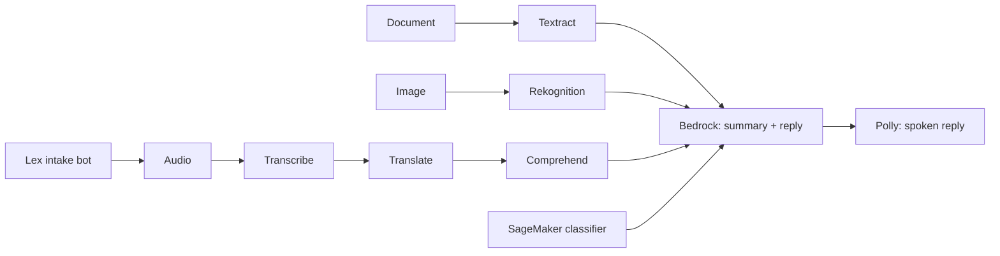

# AWS AI Support Copilot

A multilingual customer-support pipeline that turns voice calls, scanned documents and product
photos into structured cases and drafted replies, orchestrating nine AWS AI services behind a
small, testable Python core.



## Design

Every service sits behind a thin interface with an `aws` backend and a fallback backend.
`copilot doctor` probes the active credentials and reports which services are usable, so the same
code runs against a restricted lab account and a full AWS account.

## Quickstart

```bash
uv sync
aws configure --profile sandbox   # enter credentials in your terminal; never commit them
cp .env.example .env
uv run copilot doctor
```

## Verified against a restricted lab account

Results of `copilot doctor` on a time-boxed, region-locked (us-east-1) training sandbox:

| Live | Blocked (fallback backend used) |
|---|---|
| Bedrock (Nova Lite/Micro/Pro, Qwen3, gpt-oss), Textract, Comprehend (sentiment, entities, PII), Rekognition, Lex, SageMaker (read), S3, Lambda | Transcribe, Translate, Polly synthesis |

Anthropic Claude models appear in the Bedrock catalog but are not invokable from code there, so
Bedrock calls default to Amazon Nova Lite with Nova Micro/Pro, Qwen3 and gpt-oss as fallbacks.
Translate runs against Amazon Translate when allowed and falls back to Bedrock otherwise;
speech to text uses Voxtral on Bedrock. Amazon Transcribe and Polly backends are not
implemented yet, and a Bedrock Guardrail backend (`scripts/create_guardrail.py`) is covered by
stubbed tests only, because guardrails cannot be created in the lab account.

## Status

| Phase | Scope | State |
|---|---|---|
| 1 | Scaffold, config, CI, `copilot doctor` | done |
| 2 | Language services (Translate with Bedrock fallback, Comprehend PII redaction) | done; Transcribe and Polly pending |
| 3 | Documents and vision (Textract, Rekognition) | code done; live check pending |
| 4 | Bedrock summary and reply | done |
| 5 | SageMaker classifier | planned |
| 6 | Lex intake bot and UI | planned |

## Development

```bash
uv run ruff check . && uv run ruff format --check .
uv run pytest
```

Unit tests stub AWS entirely and need no account or network.
