# AWS AI Support Copilot

A multilingual customer-support copilot that turns voice calls, scanned documents and product
photos into triaged cases and drafted replies grounded in company policy. A LangGraph workflow
orchestrates Amazon Bedrock, Textract, Rekognition, Comprehend and Lex, with LangChain for the
language models, LlamaIndex for policy retrieval and S3 for storage. Services that restricted
accounts block (Translate, Transcribe, Polly, Guardrails) are switchable, with fallbacks.

```mermaid
flowchart LR
    IN[Text / audio / document / photo] --> TX[transcribe<br/>Voxtral or Transcribe]
    TX --> AT[attachments<br/>Textract, Rekognition]
    AT --> LG[language<br/>detect + translate to English]
    LG --> GI{guardrail<br/>input}
    GI -- blocked --> BL[blocked]
    GI --> IN2[insights<br/>Comprehend PII, sentiment]
    IN2 --> TR[triage<br/>Nova Micro]
    TR --> CL[classify<br/>trained model]
    CL --> RT[route<br/>persona]
    RT --> RV[retrieve<br/>LlamaIndex policy search]
    RV --> DR[draft<br/>persona + policy excerpts]
    DR -- escalation --> HR{{human review<br/>approve / edit / reject}}
    DR --> LO[localize<br/>translate back, restore details]
    HR --> LO
    HR -- rejected --> BL
    LO --> AR[archive<br/>redacted record to S3]
    BL --> AR
```



`uv run copilot graph` prints the exact diagram from the compiled workflow.

## What each part does

| Piece | Role |
|---|---|
| **LangGraph** | The workflow as an explicit state machine: conditional edges for guardrail blocks and escalations, and a checkpointed pause so a person can approve, edit or reject an escalated reply before it is sent. |
| **LangChain** (`langchain-aws`) | `ChatBedrockConverse` for triage, replies and translation, with an ordered model fallback chain. |
| **LlamaIndex** | Vector index over the policy documents in `kb/policies`, Bedrock embeddings, incremental sync, persisted locally and in S3. |
| **Amazon S3** | Durable store for the knowledge-base index and documents, and an archive of redacted case records. |
| **Bedrock, Comprehend, Textract, Rekognition, Lex** | Models, PII and sentiment, document OCR, photo labels, conversational intake. |

## What it does

1. **Understands the request.** Transcribes audio, detects the language, translates to English.
2. **Protects customer data.** PII becomes numbered tokens (`[[NAME_1]]`) before any text reaches a
   language model and is restored only in the final reply. Bare place names such as "Canada" are
   not treated as PII, because the reply may need them; street addresses are.
3. **Reads attachments.** Textract extracts receipt text; Rekognition labels product photos.
4. **Triages.** A small model returns summary, category and priority; a trained classifier
   overrides the category when it is confident.
5. **Routes to a persona** with its own prompt, temperature and model list.
6. **Grounds the reply in policy.** The policy excerpts retrieved for the question are the only
   policy facts the model may state; otherwise it says a team member will confirm.
7. **Replies in the customer's language** and archives a redacted record.

## Personas and routing

| Persona | Handles | Models (in order) |
|---|---|---|
| `billing` | billing | Nova Pro, Nova Lite |
| `shipping` | shipping | Nova Lite, Nova Micro |
| `technical` | product defects | Qwen3 32B, gpt-oss-120b, Nova Pro |
| `security` | account access | Nova Pro, Nova Lite |
| `escalation` | urgent priority, or negative sentiment with high priority | Nova Pro, Nova Lite |
| `general` | everything else | Nova Lite, Nova Micro |

Every case records the persona and why (`persona_reason`), the model used for each stage
(`models`), the policy sources used and the archive key. Personas live in a TOML file: copy
[`src/copilot/default_personas.toml`](src/copilot/default_personas.toml), edit prompts, models or
escalation rules, and set `COPILOT_PERSONAS_FILE`.

```bash
uv run copilot personas --check                          # list personas, test their models
uv run copilot analyze --text "..." --persona billing    # force a persona
uv run python scripts/evaluate_routing.py                # run 8 varied messages, show routing
```

## Policy knowledge base (LlamaIndex)

The documents in [`kb/policies`](kb/policies) describe a fictional company ("Acme Home Goods");
they exist to ground replies and are invented for testing. Retrieval searches the whole message
and, for multi-issue messages, each sentence as a separate query in parallel, then merges the
results.

```bash
uv run copilot kb build            # embed the documents, save the index, mirror it to S3
uv run copilot kb sync             # incremental: new docs added, edited docs re-embedded, removed docs dropped
uv run copilot kb sync --from-s3   # treat the bucket as the source of truth (policies edited there)
uv run copilot kb search "do you ship to Canada?"
```

`sync` gives documents stable ids (their relative path), so unchanged documents cost no embedding
calls. Mirroring to S3 prunes stale objects, and a download never deletes local files when the
bucket prefix is empty or unreachable. Enable retrieval with `COPILOT_KB_ENABLED=true`.

## S3

`scripts/create_bucket.py` creates a private bucket (public access blocked, default encryption),
verifies a write and read round trip, and prints `COPILOT_S3_BUCKET`. The bucket holds the index
(`kb-index/`), the policy documents (`kb-docs/`) and archived cases (`cases/`).

The archive stores only redacted fields (no original message and no restored reply), and an archive
failure never fails a case. Delete everything with `scripts/create_bucket.py --delete`.

## Human review for escalations

Set `COPILOT_REQUIRE_ESCALATION_REVIEW=true` (or tick the box in the web UI). An escalated case
pauses before the reply is localised; a person approves, edits or rejects the draft, and the
workflow resumes from its checkpoint. Checkpoints live in memory, so a paused case does not survive
a restart; use a persistent checkpointer before relying on this in production, and note that the
checkpoint holds the customer details needed to restore the reply.

## Quickstart

```bash
uv sync
aws configure --profile sandbox   # enter credentials in your terminal; never commit them
cp .env.example .env
uv run copilot doctor             # which AWS services your account allows
uv run python scripts/create_bucket.py
uv run copilot kb build && uv run copilot analyze --text "Do you ship to Canada?"
uv run copilot analyze --text "My mug arrived chipped" --document fixtures/receipt.png
uv run copilot analyze --audio fixtures/call.wav
uv run --group ui streamlit run app/streamlit_app.py     # web UI on http://localhost:8501
```

The UI is bound to `localhost` only: it runs with your AWS credentials, so do not expose it.

## Lex intake bot

`scripts/create_lex_bot.py` builds an Amazon Lex V2 bot from code: it asks for the order number
and issue type, confirms, and hands the case to the workflow.

```bash
uv run python scripts/create_lex_bot.py --recreate      # prints COPILOT_LEX_BOT_ID for .env
uv run copilot intake --say "my parcel is late" --say "B88231" --say "shipping" --say "yes"
uv run python scripts/create_lex_bot.py --delete
```

## Ticket classifier (SageMaker-ready)

A TF-IDF + logistic-regression model predicts the category. At confidence of at least
`COPILOT_CLASSIFIER_MIN_CONFIDENCE` (0.6) it decides the category; otherwise the LLM does.

```bash
uv run python ml/make_dataset.py                 # synthetic template tickets
uv run python ml/generate_with_bedrock.py        # varied customer styles written by Nova Pro
uv run --group ml python ml/train.py             # trains and exports ml/model/model.json
```

`ml/train.py` is a SageMaker script-mode script (`SM_CHANNEL_TRAIN`, `SM_MODEL_DIR`), so it runs
locally, in a notebook instance or as a training job. Exported weights are plain JSON, so
inference needs no ML libraries. Only the local run is verified; the lab account had no SageMaker
execution role.

Held-out results (all data synthetic; no real customer messages):

| Test set | Accuracy | Rows |
|---|---|---|
| Customer styles never seen in training (Bedrock-generated) | 98% | 168 |
| Templates never seen in training (short, partly ambiguous) | 55% | 224 |
| Hand-written messages in `fixtures/` | 100% | 6 |
| Confident predictions only (confidence >= 0.6) | 99% | 45% of test rows |

The regularisation strength `C` was chosen after comparing three values on these test sets, so the
numbers are slightly optimistic. Retrain on real labelled tickets before relying on it.

## Configuration

Copy `.env.example` to `.env`. Defaults suit a restricted account; AWS-native backends are
implemented and tested with stubs.

| Variable | Values | Default | Notes |
|---|---|---|---|
| `COPILOT_BEDROCK_MODELS` | model ids | Nova Lite first | translation; first model that responds wins |
| `COPILOT_TRIAGE_MODELS` | model ids | Nova Micro, Nova Lite | category and priority |
| `COPILOT_PERSONAS_FILE` | path to TOML | built-in | prompts, models, escalation rules |
| `COPILOT_CLASSIFIER_PATH` | path to `model.json` | empty (off) | below the confidence threshold the LLM decides |
| `COPILOT_KB_ENABLED` | `true`, `false` | `false` | policy retrieval; needs the index (`copilot kb build`) |
| `COPILOT_EMBEDDING_MODEL` | model id | Titan Text Embeddings V2 | used to embed documents and queries |
| `COPILOT_KB_TOP_K`, `COPILOT_KB_MIN_SCORE` | number | 3, 0.18 | retrieval size and relevance cut-off |
| `COPILOT_S3_BUCKET` | bucket name | empty | enables S3 index mirroring and the case archive |
| `COPILOT_ARCHIVE_CASES` | `true`, `false` | `true` | only active when a bucket is set |
| `COPILOT_REQUIRE_ESCALATION_REVIEW` | `true`, `false` | `false` | pause escalations for a human |
| `COPILOT_LEX_BOT_ID` | bot id | empty | from `create_lex_bot.py`; alias is the DRAFT test alias |
| `COPILOT_TRANSLATE_BACKEND` | `bedrock`, `aws`, `auto` | `bedrock` | `auto` tries Amazon Translate, falls back to Bedrock |
| `COPILOT_TRANSCRIBE_BACKEND` | `bedrock`, `aws` | `bedrock` | `aws` needs `COPILOT_TRANSCRIBE_BUCKET` |
| `COPILOT_TTS_BACKEND` | `off`, `polly` | `off` | `polly` enables `copilot analyze --speak` |
| `COPILOT_GUARDRAIL_ID` | id | empty | create with `scripts/create_guardrail.py`; pin the version outside development |

## Verified against a restricted lab account

Results from a time-boxed, region-locked (us-east-1) training sandbox:

| Ran live | Blocked (switches retained, stub-tested only) |
|---|---|
| Bedrock (Nova Lite/Micro/Pro, Qwen3, gpt-oss, Voxtral), Bedrock embeddings (Titan V2, Cohere, Nova multimodal), Lex (built and conversed with from code), Textract, Comprehend, Rekognition, S3 (private bucket, round trip) | Translate, Transcribe, Polly, Bedrock Guardrails, SageMaker training and endpoints, S3 lifecycle rules |

Vector stores: every self-hosted AWS option was denied (S3 Vectors, OpenSearch Serverless and
managed, Aurora pgvector, MemoryDB, Neptune Analytics, DocumentDB). Bedrock Knowledge Bases can be
listed but need an IAM service role the account cannot create, so the index is a local LlamaIndex
store mirrored to S3. `copilot doctor` shows the same probes for your own account. Anthropic Claude
models appear in the Bedrock catalog but cannot be invoked from code there, and the lab provider
confirmed that Lambda's access to the AI services cannot be changed, so there is no Lambda path.

## Performance notes

Measured on the lab account (n=4 cases, a median of about 4.4 s per case; run-to-run noise was
about 0.7 s):

- Running triage, the classifier and retrieval as parallel graph branches, and Textract beside
  Rekognition, worked and was tested, but gave **no measurable end-to-end gain**, so it was removed.
- Searching three sub-queries in parallel inside the retriever took 0.45 s against 1.15 s one after
  another, so that stays.
- Reusing one AWS client per service cut an S3 write from 1.25 s to 0.53 s; a new client pays for
  a new TLS connection each time.

## Cost

Everything is pay-per-request with no always-on resources. A single case makes a handful of small
API calls (typically a fraction of a cent on Nova Lite); Textract and Rekognition are billed per
page or image. Check current AWS pricing before running large batches, and delete the bucket and
Lex bot when finished.

## Development

```bash
uv run ruff check . && uv run ruff format --check .
uv run pytest
```

Unit tests stub AWS and need no account or network; they ignore your local `.env`. CI runs lint,
tests and a gitleaks scan of the full history.

## License

MIT
