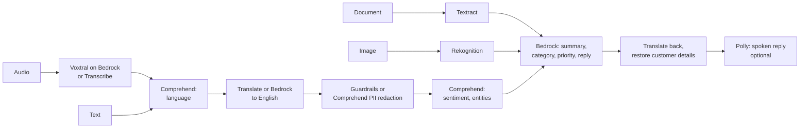

# AWS AI Support Copilot

A multilingual customer-support pipeline that turns voice calls, scanned documents and product
photos into structured cases and drafted replies. It orchestrates Amazon Bedrock, Textract,
Rekognition, Comprehend and (optionally) Translate, Transcribe, Polly and Bedrock Guardrails
behind a small, testable Python core.



## What it does

1. **Understands the request.** Transcribes audio, detects the language, translates to English.
2. **Protects customer data.** PII is replaced with numbered tokens (`[[NAME_1]]`) before any text
   reaches a language model, and restored only in the final reply.
3. **Reads attachments.** Textract extracts receipt text; Rekognition labels product photos.
4. **Triages.** A small, cheap model (Nova Micro) returns a summary, category and priority.
5. **Routes to a persona.** Each persona has its own prompt, temperature and model list, so a
   billing question, a damaged product and an angry customer are handled by different agents.
6. **Replies in the customer's language.**

## Personas and routing

| Persona | Handles | Models (in order) |
|---|---|---|
| `billing` | billing | Nova Pro, Nova Lite |
| `shipping` | shipping | Nova Lite, Nova Micro |
| `technical` | product defects | Qwen3 32B, gpt-oss-120b, Nova Pro |
| `security` | account access | Nova Pro, Nova Lite |
| `escalation` | urgent priority, or negative sentiment with high priority | Nova Pro, Nova Lite |
| `general` | everything else | Nova Lite, Nova Micro |

Every case records which persona handled it and why (`persona_reason`) and which model answered
each stage (`models`). Personas live in a TOML file: copy
[`src/copilot/default_personas.toml`](src/copilot/default_personas.toml), edit prompts, models
or escalation rules, and set `COPILOT_PERSONAS_FILE`.

```bash
uv run copilot personas --check          # list personas and test that their models respond
uv run copilot analyze --text "..." --persona billing   # force a persona
uv run python scripts/evaluate_routing.py               # run 8 varied messages and show routing
```

Replies are constrained to the case facts: the model may not invent delivery times, prices or
policies, and customer names are only restored after the model has written the reply.

Example (`copilot analyze --text "Hola, mi pedido 48213 llegó roto. Soy Maria Lopez, mi correo es
maria.lopez@example.com. Quiero un reembolso."`):

```json
{
  "source_language": "es",
  "english_text": "Hello, my order 48213 arrived broken. I am [[NAME_1]], my email is [[EMAIL_1]]. I want a refund.",
  "sentiment": "NEGATIVE",
  "category": "product_defect",
  "reply": "Estimado Maria Lopez, lamentamos las molestias causadas por el artículo roto en su pedido 48213. ...",
  "model_id": "amazon.nova-lite-v1:0"
}
```

## Quickstart

```bash
uv sync
aws configure --profile sandbox   # enter credentials in your terminal; never commit them
cp .env.example .env
uv run copilot doctor             # shows which AWS services your account allows
uv run copilot analyze --text "My mug arrived chipped" --document fixtures/receipt.png
uv run copilot analyze --audio fixtures/call.wav
```

`copilot doctor` probes the active credentials and lists what is usable, so the same code runs
against a restricted lab account and a full AWS account.

## Lex intake bot

`scripts/create_lex_bot.py` builds an Amazon Lex V2 bot (`SupportIntake`) from code: it asks for the
order number and issue type, confirms, and hands the collected case to the pipeline.

```bash
uv run python scripts/create_lex_bot.py --recreate      # prints COPILOT_LEX_BOT_ID for .env
uv run copilot intake                                    # chat with the bot, then triage the case
uv run copilot intake --say "my parcel is late" --say "B88231" --say "shipping" --say "yes"
uv run python scripts/create_lex_bot.py --delete        # clean up
```

## Web UI

A Streamlit app wraps the same pipeline: type or upload a request (text, receipt, product photo,
voice message), chat with the Lex intake bot, and inspect the personas and routing rules. Each
result shows which persona handled the case and why, which model answered each stage, what was
redacted, and the full JSON.

```bash
uv run --group ui streamlit run app/streamlit_app.py     # then open http://localhost:8501
```

The app uses your `.env` and AWS profile like the CLI. It is bound to `localhost` only (see
`.streamlit/config.toml`): it runs with your AWS credentials, so do not expose it to a network.

## Ticket classifier (SageMaker-ready)

A TF-IDF + logistic-regression model predicts the ticket category. When it is confident
(`COPILOT_CLASSIFIER_MIN_CONFIDENCE`, default 0.6) it decides the category and the LLM triage only
supplies the summary and priority; otherwise the LLM decides. Each case records `category_source`
(`classifier` or `llm`) and the confidence.

```bash
uv run python ml/make_dataset.py                          # synthetic template tickets
uv run python ml/generate_with_bedrock.py                 # varied styles written by Nova Pro
uv run --group ml python ml/train.py                      # trains and exports ml/model/model.json
COPILOT_CLASSIFIER_PATH=ml/model/model.json uv run copilot analyze --text "..."
```

`ml/train.py` is a SageMaker script-mode script: it reads `SM_CHANNEL_TRAIN` and writes to
`SM_MODEL_DIR`, so the same file runs locally, in a SageMaker notebook instance
(`git clone` the repo, `pip install scikit-learn`, `python ml/train.py`) or as a training job. The
exported weights are plain JSON, so inference needs no ML libraries.

Held-out results (all data is synthetic; no real customer messages):

| Test set | Accuracy | Rows |
|---|---|---|
| Customer styles never seen in training (Bedrock-generated) | 98% | 168 |
| Templates never seen in training (short, partly ambiguous) | 55% | 224 |
| Hand-written messages in `fixtures/` | 100% | 6 |
| Confident predictions only (confidence >= 0.6) | 99% | 45% of test rows |

The regularisation strength `C` was chosen after comparing three values on these test sets, so the
numbers are slightly optimistic. Treat the classifier as a fast first pass in front of the LLM, not
a production model: retrain on real labelled tickets before relying on it.

## Configuration

Services that are commonly blocked in lab accounts are switchable in `.env` (see `.env.example`).
Defaults run in a restricted account; the AWS-native backends are implemented and tested with stubs.

| Variable | Values | Default | Notes |
|---|---|---|---|
| `COPILOT_TRANSLATE_BACKEND` | `bedrock`, `aws`, `auto` | `bedrock` | `auto` tries Amazon Translate, then Bedrock if denied; `aws` never falls back |
| `COPILOT_TRANSCRIBE_BACKEND` | `bedrock`, `aws` | `bedrock` | `aws` uses Amazon Transcribe and needs `COPILOT_TRANSCRIBE_BUCKET` |
| `COPILOT_TTS_BACKEND` | `off`, `polly` | `off` | `polly` enables `copilot analyze --speak reply.mp3` |
| `COPILOT_GUARDRAIL_ID` | guardrail id or empty | empty | create one with `scripts/create_guardrail.py` |
| `COPILOT_BEDROCK_MODELS` | comma-separated model ids | Nova Lite first | used for translation fallback; first model that responds wins |
| `COPILOT_TRIAGE_MODELS` | comma-separated model ids | Nova Micro, Nova Lite | classifies category and priority |
| `COPILOT_LEX_BOT_ID` | bot id | empty | set to the id printed by `create_lex_bot.py`; alias defaults to the DRAFT test alias |
| `COPILOT_CLASSIFIER_PATH` | path to `model.json` | empty (off) | enables the trained classifier; below `COPILOT_CLASSIFIER_MIN_CONFIDENCE` the LLM decides |
| `COPILOT_PERSONAS_FILE` | path to TOML | built-in personas | custom prompts, models and escalation rules |

## Verified against a restricted lab account

Results from a time-boxed, region-locked (us-east-1) training sandbox:

| Ran live | Blocked (config switches retained, stub-tested only) |
|---|---|
| Bedrock (Nova Lite/Micro/Pro, Qwen3, gpt-oss, Voxtral), Lex (bot built and conversed with from code), Textract, Comprehend (language, sentiment, entities, PII), Rekognition | Translate, Transcribe, Polly, Bedrock Guardrails, SageMaker training and endpoints |

Anthropic Claude models appear in the Bedrock catalog there but cannot be invoked from code, so
Bedrock calls default to Amazon Nova Lite with other models as fallbacks.

## Cost

Everything is pay-per-request with no always-on resources in the default configuration. A single
`analyze` run makes a handful of small API calls and typically costs a fraction of a cent on Nova
Lite; Textract and Rekognition are billed per page or image. Check current AWS pricing before
running large batches.

## Roadmap

| Phase | Scope | State |
|---|---|---|
| 1 | Scaffold, config, CI, `copilot doctor` | done |
| 2 | Language services, PII redaction, translation fallback | done |
| 3 | Textract and Rekognition inputs | done |
| 4 | Bedrock triage and reply, optional Guardrails | done |
| 5 | Ticket classifier (SageMaker-compatible training) | done |
| 6 | Lex intake bot | done |
| 7 | Web UI (Streamlit) | done |

## Development

```bash
uv run ruff check . && uv run ruff format --check .
uv run pytest
```

Unit tests stub AWS entirely and need no account or network. CI runs lint, tests and a gitleaks
scan of the full history.

## License

MIT
