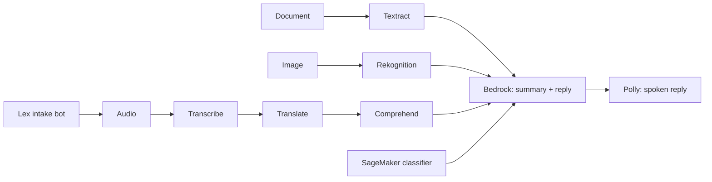

# AWS AI Support Copilot

A multilingual customer-support pipeline that turns voice calls, scanned documents and product
photos into structured cases and drafted replies, orchestrating nine AWS AI services behind a
small, testable Python core.



## Design

Every service sits behind a thin interface with an `aws` backend and a fallback backend.
`copilot doctor` probes the active credentials and reports which services are usable, so the same
code runs against a restricted lab account and a full AWS account.

## Quickstart

```bash
uv sync
aws configure --profile sandbox   # enter credentials in your terminal; never commit them
cp .env.example .env
uv run copilot doctor
```

## Verified against a restricted lab account

Results of `copilot doctor` on a time-boxed, region-locked (us-east-1) training sandbox:

| Live | Blocked (fallback backend used) |
|---|---|
| Bedrock (Nova Lite/Micro/Pro, Qwen3, gpt-oss), Textract, Comprehend (sentiment, entities, PII), Rekognition, Lex, SageMaker (read), S3, Lambda | Transcribe, Translate, Polly synthesis |

Anthropic Claude models appear in the Bedrock catalog but are not invokable from code there, so
Bedrock calls default to Amazon Nova Lite with Nova Micro/Pro, Qwen3 and gpt-oss as fallbacks.
Translate runs against Amazon Translate when allowed and falls back to Bedrock otherwise;
speech to text uses Voxtral on Bedrock. The Amazon Transcribe, Polly and Bedrock Guardrails
backends are implemented and covered by stubbed tests only, because those services are blocked in
the lab account.

## Configuration

Each service that is commonly blocked in lab accounts is switchable in `.env` (see
`.env.example`). Defaults run in a restricted account; the AWS-native backends are retained and
tested with stubs.

| Variable | Values | Default | Notes |
|---|---|---|---|
| `COPILOT_TRANSLATE_BACKEND` | `bedrock`, `aws`, `auto` | `bedrock` | `auto` tries Amazon Translate, then Bedrock if denied; `aws` never falls back |
| `COPILOT_TRANSCRIBE_BACKEND` | `bedrock`, `aws` | `bedrock` | `aws` uses Amazon Transcribe and needs `COPILOT_TRANSCRIBE_BUCKET` |
| `COPILOT_TTS_BACKEND` | `off`, `polly` | `off` | `polly` enables `copilot analyze --speak reply.mp3` |
| `COPILOT_GUARDRAIL_ID` | guardrail id or empty | empty | create one with `scripts/create_guardrail.py` |
| `COPILOT_BEDROCK_MODELS` | comma-separated model ids | Nova Lite first | first model that responds is used |

## Running as an AWS Lambda

`src/copilot/handler.py` exposes the same pipeline as a Lambda function (JSON in, case JSON out;
documents, images and audio are passed as base64). Credentials come from the execution role.

```bash
uv run python scripts/package_lambda.py                       # builds dist/support-copilot.zip (~18 MB)
uv run python scripts/deploy_lambda.py deploy --role-arn <role-arn>
uv run python scripts/deploy_lambda.py invoke --text "My order arrived broken"
uv run python scripts/deploy_lambda.py delete
```

The role must allow the services you enable (Bedrock `InvokeModel`, Comprehend, Textract,
Rekognition, and so on). In the restricted lab account used during development the only available
role grants logging only: deploy and invocation work and the function reports the missing Bedrock
permission as a 502, so end-to-end runs there use the CLI.

## Status

| Phase | Scope | State |
|---|---|---|
| 1 | Scaffold, config, CI, `copilot doctor` | done |
| 2 | Language services (Translate with Bedrock fallback, Comprehend PII redaction) | done; Transcribe and Polly pending |
| 3 | Documents and vision (Textract, Rekognition) | code done; live check pending |
| 4 | Bedrock summary and reply | done |
| 5 | SageMaker classifier | planned |
| 6 | Lex intake bot and UI | planned |

## Development

```bash
uv run ruff check . && uv run ruff format --check .
uv run pytest
```

Unit tests stub AWS entirely and need no account or network.
